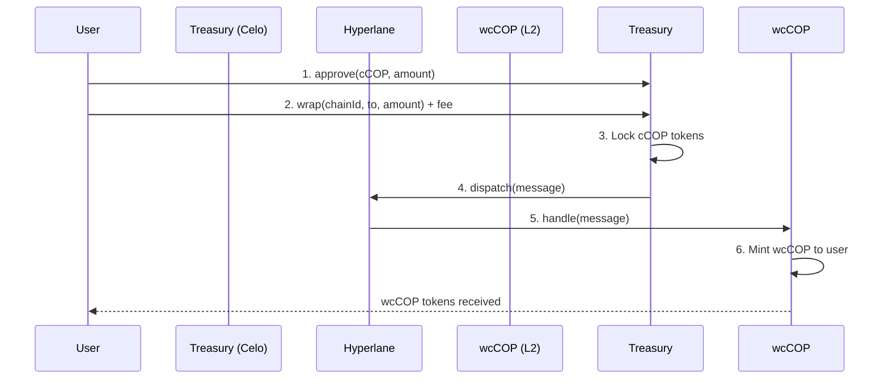
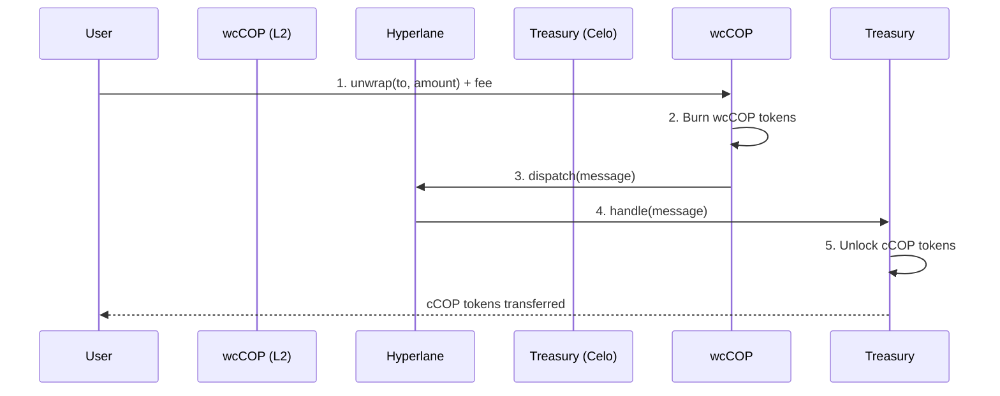

# cCOP Wrapper - Comprehensive Project Context

**Last Updated:** October 2025
**Author:** AI Assistant - Technical Documentation

---

## Executive Summary

The **cCOP Wrapper** is a decentralized cross-chain bridge application that enables users to transfer Colombian Peso stablecoin (cCOP) tokens between Celo blockchain and multiple Layer 2 networks (Base, Arbitrum, Optimism, and Avalanche). The system uses Hyperlane's permissionless interoperability protocol for secure cross-chain messaging, eliminating the need for centralized custodians.

### Core Value Proposition
- **Trust-Minimized Bridge**: Uses Hyperlane's decentralized validators instead of centralized custodians
- **Multi-Chain Support**: Bridge cCOP to 4 different destination chains
- **User-Friendly**: Modern web interface with wallet connection and real-time transaction tracking
- **Secure**: Auditable smart contracts with emergency controls and admin governance

---

## Project Architecture

### High-Level System Design

```
┌─────────────────────────────────────────────────────────────────┐
│                         USER INTERFACE                          │
│                    (Next.js 15 + React 19)                      │
│                                                                 │
│  ┌──────────────┐  ┌──────────────┐  ┌──────────────┐        │
│  │   Wrapper    │  │  Unwrapper   │  │ Transaction  │        │
│  │  Component   │  │  Component   │  │   History    │        │
│  └──────────────┘  └──────────────┘  └──────────────┘        │
└─────────────────────────────────────────────────────────────────┘
                              │
                    ┌─────────▼─────────┐
                    │   Wagmi/Viem      │
                    │   (Web3 Layer)    │
                    └─────────┬─────────┘
                              │
        ┌─────────────────────┴─────────────────────┐
        │                                           │
┌───────▼────────┐                         ┌───────▼────────┐
│  CELO NETWORK  │                         │  L2 NETWORKS   │
│                │                         │                │
│  ┌──────────┐  │                         │  ┌──────────┐  │
│  │ Treasury │  │◄────── Hyperlane ──────►│  │ wcCOP    │  │
│  │ Contract │  │      Cross-Chain        │  │ Contract │  │
│  └──────────┘  │       Messaging         │  └──────────┘  │
│                │                         │                │
│  cCOP Token    │                         │  Base, Arb,    │
│  (Lock/Unlock) │                         │  Optimism,     │
└────────────────┘                         │  Avalanche     │
                                          └────────────────┘
```

---

## Technology Stack

### Smart Contracts (Foundry)
- **Language**: Solidity ^0.8.20
- **Framework**: Foundry
- **Dependencies**:
  - OpenZeppelin Contracts ^5.0.0 (ERC20, security patterns)
  - Hyperlane Core (cross-chain messaging)
  - Forge-Std (testing utilities)

### Frontend (Next.js)
- **Framework**: Next.js 15.5.2 (App Router)
- **Language**: TypeScript 5.x
- **UI**: React 18.3.1 with CSS Modules
- **Web3 Integration**:
  - `wagmi` v2.12.31 - React hooks for Ethereum
  - `viem` v2.21.44 - TypeScript Ethereum library
  - `@reown/appkit` v1.7.10 - Multi-wallet connection (formerly WalletConnect)
  - `@tanstack/react-query` v5.59.20 - Data fetching and caching
- **Additional Features**:
  - `@farcaster/miniapp-sdk` v0.2.1 - Farcaster integration
  - `@divvi/referral-sdk` v2.2.0 - Referral tracking
  - `@selfxyz/core` - Gas fee sponsorship
  - `react-hot-toast` - User notifications
  - `framer-motion` - UI animations

---

## Smart Contract Architecture

### 1. Treasury.sol (Celo Network)
**Location**: `/contracts/src/Treasury.sol`
**Deployed on**: Celo Mainnet & Alfajores Testnet

**Purpose**: Manages cCOP token locking/unlocking and initiates cross-chain messages to mint wcCOP on destination chains.

**Key Functions**:
- `wrap(uint32 _domainId, address _to, uint256 _amount)` - Lock cCOP and send cross-chain message to mint wcCOP
- `handle(uint32 _origin, bytes32 _sender, bytes calldata _data)` - Receive cross-chain message to unlock cCOP
- `getQuote(uint32 _domainId, address _to, uint256 _amount)` - Get Hyperlane message fee quote

**Security Features**:
- Admin-controlled with 1-day timelock for critical changes
- Emergency pause mechanism (`fuse`)
- Chain ID validation (only authorized chains can interact)
- Amount validation (prevents zero-value and overflow attacks)

**State Variables**:
- `admin` - Admin address with proposal system
- `mailboxAddress` - Hyperlane mailbox contract address
- `cCOPAddress` - cCOP token address on Celo
- `wrappedToken` - Mapping of domain IDs to wcCOP contract addresses
- `fuse` - Emergency stop flag

### 2. WrappedCCOP.sol (Layer 2 Networks)
**Location**: `/contracts/src/WrappedCCOP.sol`
**Deployed on**: Base, Arbitrum, Optimism, Avalanche

**Purpose**: ERC20 wrapper contract that mints wcCOP when receiving cross-chain messages from Treasury, and burns wcCOP to unlock original cCOP.

**Key Functions**:
- `handle(uint32 _origin, bytes32 _sender, bytes calldata _data)` - Receive cross-chain message to mint wcCOP
- `unwrap(address _to, uint256 _amount)` - Burn wcCOP and send cross-chain message to unlock cCOP
- `getQuote(address _to, uint256 _amount)` - Get Hyperlane message fee quote

**ERC20 Details**:
- Name: "Wrapped Celo Colombian Peso"
- Symbol: "wcCOP"
- Decimals: 18 (inherited from OpenZeppelin ERC20)

**Security Features**:
- Same admin/pause/timelock system as Treasury
- Only Treasury contract can trigger minting
- Burn-to-unlock ensures 1:1 backing

### 3. GasFeeSponsorship.sol
**Location**: `/contracts/src/GasFeeSponsorship.sol`
**Purpose**: Integration with Self.xyz for gas fee sponsorship to subsidize user transactions.

### 4. CCOPMock.sol (Testing Only)
**Location**: `/contracts/src/CCOPMock.sol`
**Purpose**: Mock ERC20 token simulating cCOP for testnet deployments.

---

## Cross-Chain Flow Deep Dive

### Wrapping Process (Celo → L2)



**Step-by-Step**:
1. User approves Treasury contract to spend cCOP tokens
2. User calls `wrap()` with:
   - `_domainId`: Destination chain (e.g., 8453 for Base)
   - `_to`: Recipient address on destination chain
   - `_amount`: Amount of cCOP to wrap
   - `msg.value`: Hyperlane message fee (obtained from `getQuote()`)
3. Treasury locks cCOP tokens in contract
4. Treasury sends cross-chain message via Hyperlane Mailbox
5. Hyperlane validators relay message to destination chain
6. wcCOP contract's `handle()` function receives message
7. wcCOP mints equivalent tokens to specified address

### Unwrapping Process (L2 → Celo)



**Step-by-Step**:
1. User calls `unwrap()` on wcCOP contract with:
   - `_to`: Recipient address on Celo
   - `_amount`: Amount of wcCOP to unwrap
   - `msg.value`: Hyperlane message fee
2. wcCOP burns user's tokens
3. wcCOP sends cross-chain message via Hyperlane
4. Hyperlane validators relay message to Celo
5. Treasury's `handle()` function receives message
6. Treasury unlocks and transfers cCOP to recipient

---

## Frontend Architecture

### Directory Structure

```
dapp/src/
├── app/                    # Next.js App Router
│   ├── page.tsx           # Main landing page
│   ├── layout.tsx         # Root layout with providers
│   ├── globals.css        # Global styles
│   ├── miniapp.css        # Farcaster miniapp styles
│   └── dashboard/         # Transaction history page
│
├── components/            # React UI components
│   ├── WrapperComponent.tsx        # Wrapping interface
│   ├── UnwrapperComponent.tsx      # Unwrapping interface
│   ├── BalanceIndicators*.tsx      # Balance display components
│   ├── TransactionHistory.tsx      # Transaction tracking
│   ├── ConnectButton.tsx           # Wallet connection
│   ├── TokenMenu.tsx               # Wrap/Unwrap toggle
│   ├── SelfGasFeeSponsorshipComponent.tsx  # Gas sponsorship UI
│   ├── MiniappWrapper.tsx          # Farcaster miniapp container
│   └── Footer.tsx                  # Footer component
│
├── config/                # Configuration
│   └── index.ts          # Wagmi/AppKit setup
│
├── constants/            # Contract addresses and chain configs
│   ├── address.tsx       # Deployed contract addresses
│   ├── chainID.tsx       # Supported chain IDs
│   ├── price-feeds.ts    # Token price feed configs
│   └── abis/            # Contract ABIs
│       ├── Treasury.json
│       ├── WrappedCCOP.json
│       └── GasFeeSponsorship.json
│
├── context/              # React Context providers
│   ├── BalanceContext.tsx      # Global balance management
│   ├── FarcasterContext.tsx    # Farcaster miniapp state
│   └── index.tsx              # Combined providers
│
├── hooks/                # Custom React hooks
│   └── useTokenBalances.ts    # Token balance fetching
│
└── utils/                # Utility functions
    ├── hyperlane.ts           # Hyperlane message tracking
    ├── gas-estimation.ts      # Gas cost calculations
    ├── price-feeds.ts         # Price feed integration
    ├── transaction-service.ts # Transaction history API
    ├── divvi.ts              # Referral tracking
    ├── farcaster.ts          # Farcaster integration helpers
    ├── mobile.ts             # Mobile detection
    └── number-format.ts      # Number formatting utilities
```

### Key Components

#### 1. WrapperComponent.tsx
**Purpose**: Interface for wrapping cCOP tokens to wcCOP on destination chains.

**Features**:
- Amount input with validation (max balance, min > 0)
- Percentage quick-select buttons (25%, 50%, 75%, 100%)
- Chain selector (Base, Arbitrum, Optimism, Avalanche) with 2x2 grid on mobile
- Real-time USD value prediction
- Gas cost estimation
- Hyperlane fee quote display
- Custom recipient address option
- Two-step process: Set Allowance → Wrap
- Integration with Self.xyz gas sponsorship

**State Management**:
- Local state for amount, selected chain, validation
- Global balance context for cCOP balance
- Wagmi hooks for blockchain interactions

#### 2. UnwrapperComponent.tsx
**Purpose**: Interface for unwrapping wcCOP back to cCOP on Celo.

**Features**:
- Similar UI to WrapperComponent
- Multi-chain source selection (Base, Arbitrum, Optimism, Avalanche)
- Automatic chain switching
- Balance tracking per L2 chain
- One-step unwrap process (no approval needed, burns tokens directly)

**Chain-Specific Logic**:
- Dynamically updates balance based on selected source chain
- Validates sufficient wcCOP balance on selected chain
- Switches user's wallet to correct network before transaction

#### 3. BalanceContext.tsx
**Purpose**: Global state management for token balances across all chains.

**Features**:
- Fetches balances for:
  - cCOP on Celo
  - wcCOP on Base
  - wcCOP on Arbitrum
  - wcCOP on Optimism
  - wcCOP on Avalanche
- Automatic refresh on network/account changes
- Manual refresh function for post-transaction updates
- Caches balance data to reduce RPC calls

**Implementation**:
```typescript
const BalanceContext = createContext({
  balances: {
    celo: "0",
    base: "0",
    arb: "0",
    op: "0",
    avax: "0"
  },
  refresh: () => {}
});
```

#### 4. TransactionHistory.tsx
**Purpose**: Display and track cross-chain transaction history.

**Features**:
- Fetches transaction data from custom API service
- Displays wrap and unwrap transactions
- Shows transaction status (pending, delivered, failed)
- Links to block explorers
- Hyperlane message tracking
- Filters by transaction type

**Data Source**:
- Uses `transaction-service.ts` to fetch from backend API
- Polls for status updates on pending transactions

### Responsive Design Strategy

#### Desktop View (>768px)
- **Chain Selector**: Horizontal flex layout with 4 buttons in a row
- **Larger Touch Targets**: 50px min-height buttons, 14px font
- **Full Width Forms**: Maximum usability on large screens

#### Mobile View (≤768px)
- **Chain Selector**: 2x2 grid layout for better mobile UX
- **Compact Buttons**: 42px height, 12px font
- **Optimized Spacing**: Reduced gaps and padding

#### Farcaster Miniapp (.farcaster-miniapp class)
- **Extra Compact**: All elements reduced by ~15-20%
- **Chain Grid**: 2x2 grid with 38px button height
- **Hidden Elements**: Dashboard link hidden to save space
- **Optimized Forms**: Smaller inputs, tighter spacing

**CSS Implementation** (in `/dapp/src/app/miniapp.css`):
```css
/* Desktop - Horizontal */
body:not(.farcaster-miniapp) [class*="chainSelector"] {
  display: flex !important;
  flex-direction: row !important;
  overflow-x: auto !important;
}

/* Mobile - 2x2 Grid */
@media (max-width: 768px) {
  body:not(.farcaster-miniapp) [class*="chainSelector"] {
    display: grid !important;
    grid-template-columns: 1fr 1fr !important;
  }
}

/* Miniapp - 2x2 Grid */
.farcaster-miniapp [class*="chainSelector"] {
  display: grid !important;
  grid-template-columns: 1fr 1fr !important;
  gap: 6px !important;
}
```

---

## Network Configuration

### Supported Networks

| Network | Chain ID (Mainnet) | Chain ID (Testnet) | Role |
|---------|-------------------|-------------------|------|
| **Celo** | 42220 | 44787 | Source (cCOP origin) |
| **Base** | 8453 | 84532 | Destination (wcCOP) |
| **Arbitrum** | 42161 | 421614 | Destination (wcCOP) |
| **Optimism** | 10 | 11155420 | Destination (wcCOP) |
| **Avalanche** | 43114 | 43113 | Destination (wcCOP) |

### Deployed Contract Addresses

#### Mainnet
```typescript
{
  celo: {
    cCOP: "0x8A567e2aE79CA692Bd748aB832081C45de4041eA",
    treasury: "0x5Cc112D9634a2D0cB3A0BA8dDC5dC05a010A3D22"
  },
  base: {
    wcCOP: "0x5Cc112D9634a2D0cB3A0BA8dDC5dC05a010A3D22"
  },
  arbitrum: {
    wcCOP: "0x5Cc112D9634a2D0cB3A0BA8dDC5dC05a010A3D22"
  },
  optimism: {
    wcCOP: "0x5Cc112D9634a2D0cB3A0BA8dDC5dC05a010A3D22"
  },
  avalanche: {
    wcCOP: "0x5Cc112D9634a2D0cB3A0BA8dDC5dC05a010A3D22"
  }
}
```

#### Testnet
```typescript
{
  celoAlfajores: {
    cCOP: "0xeF760Ba3281205ec8baB0E63Be0c74a734D11825",
    treasury: "0xAF4387cC9105C9B716B9B84F673996dCa7ac5150"
  },
  baseSepolia: {
    wcCOP: "0x7B9AeD47626Fb43a4EFbFa11c21143158F5C3094"
  }
}
```

---

## Hyperlane Integration

### Overview
Hyperlane provides the cross-chain messaging infrastructure that enables secure token transfers without centralized custodians.

### Key Concepts

**Domain IDs**: Hyperlane uses domain IDs (not chain IDs) to identify networks:
- Domain IDs map to chain IDs in most cases
- Used in `wrap()` and `unwrap()` functions to specify destination

**Mailbox Contract**: Core Hyperlane contract on each chain that:
- Dispatches outgoing messages
- Delivers incoming messages
- Manages security modules (validators, ISMs)

**Message Format**:
```solidity
// Wrap message (Treasury → wcCOP)
bytes memory message = abi.encode(
    recipient,  // address to receive wcCOP
    amount      // uint256 amount to mint
);

// Unwrap message (wcCOP → Treasury)
bytes memory message = abi.encode(
    recipient,  // address to receive cCOP
    amount      // uint256 amount to unlock
);
```

**Fee Calculation**:
```typescript
// Get quote from contract
const quote = await treasuryContract.getQuote(domainId, recipient, amount);

// Include as msg.value when wrapping
await treasuryContract.wrap(domainId, recipient, amount, {
  value: quote + 1n  // Add 1 wei buffer for safety
});
```

### Message Tracking
The frontend uses `waitForIsDelivered()` utility to track message status:

```typescript
// From utils/hyperlane.ts
export const waitForIsDelivered = async (
  msgId: string,
  intervalMs: number,
  maxAttempts: number
): Promise<boolean> => {
  // Polls Hyperlane explorer API for delivery status
  // Returns true when message is delivered
  // Throws error if max attempts exceeded
};
```

---

## Special Integrations

### 1. Farcaster Miniapp
**Files**:
- `/dapp/src/components/MiniappWrapper.tsx`
- `/dapp/src/context/FarcasterContext.tsx`
- `/dapp/src/app/miniapp.css`
- `/dapp/src/utils/farcaster.ts`

**Purpose**: Optimized version of the app for Farcaster frames.

**Features**:
- Automatic detection of Farcaster environment
- Custom CSS optimizations for small screens
- Farcaster-specific wallet connector
- Compact 2x2 grid chain selector
- Reduced component sizes and spacing

**Implementation**:
```typescript
// Auto-detect Farcaster environment
const isFarcaster = useMemo(() => {
  return typeof window !== 'undefined' &&
         window.location.search.includes('farcaster');
}, []);

// Apply .farcaster-miniapp class to body
useEffect(() => {
  if (isFarcaster) {
    document.body.classList.add('farcaster-miniapp');
  }
}, [isFarcaster]);
```

### 2. Divvi Referral System
**File**: `/dapp/src/utils/divvi.ts`

**Purpose**: Track referrals and attribute transactions to referrers.

**Features**:
- Generates unique referral tags per wallet
- Appends referral data to transaction calldata
- Submits referral info to Divvi API post-transaction

**Implementation**:
```typescript
// Generate referral tag
const referralTag = generateReferralTag(userAddress);

// Add to transaction as data suffix
writeContract(config, {
  ...contractParams,
  dataSuffix: `0x${referralTag}` as `0x${string}`
});

// Submit to Divvi API
submitDivviReferral(txHash, chainId);
```

### 3. Self.xyz Gas Sponsorship
**Files**:
- `/dapp/src/components/SelfGasFeeSponsorshipComponent.tsx`
- `/contracts/src/GasFeeSponsorship.sol`

**Purpose**: Subsidize gas costs for users through Self Protocol.

**Features**:
- QR code generation for gas sponsorship claims
- On-chain gas fee tracking
- User-friendly sponsorship UI

---

## Development Workflow

### Smart Contract Development

**Testing Strategy**:
```bash
# Unit tests - correct scenarios
forge test --match-path test/unit/Treasury/correct/*

# Unit tests - revert scenarios
forge test --match-path test/unit/Treasury/revert/*

# Fuzz testing
forge test --match-path test/fuzz/WrappedCCOP/*

# Gas analysis
forge snapshot
```

**Deployment**:
```bash
# Using Makefile
make deployTreasury_TEST          # Testnet
make deployWrappedCCOP_BaseTest   # Base testnet
make deployTreasury               # Mainnet
make deployWrappedCCOP_Base       # Base mainnet

# Manual deployment
forge script script/Treasury.s.sol:TreasuryScript \
  --rpc-url $RPC_URL_CELO_MAINNET \
  --account defaultKey \
  --broadcast \
  --verify
```

### Frontend Development

**Development Server**:
```bash
cd dapp
pnpm install
pnpm dev  # Runs on http://localhost:3000
```

**Build & Deploy**:
```bash
pnpm build      # Production build
pnpm start      # Production server
pnpm lint       # ESLint check
```

**Environment Variables** (`.env.local`):
```env
NEXT_PUBLIC_WALLETCONNECT_PROJECT_ID=your_project_id
NEXT_PUBLIC_ENVIRONMENT=mainnet  # or testnet
```

---

## Security Considerations

### Smart Contract Security

**1. Admin Controls**:
- 1-day timelock for critical parameter changes
- Proposal-based system for admin actions
- Cannot bypass waiting period

**2. Emergency Mechanisms**:
- `fuse` flag for emergency pause
- Can be toggled by admin instantly
- Stops all wrapping/unwrapping when disabled

**3. Input Validation**:
```solidity
// Amount validation
if (_amount == 0) revert AmountMustBeGreaterThanZero();

// Chain validation
if (wrappedToken[_domainId].current == bytes32(0))
    revert ChainIdNotAuthorized();

// Sender validation (in handle function)
if (_sender != wrappedToken[_origin].current)
    revert SenderNotAuthorized();
```

**4. Message Security**:
- Only authorized Hyperlane mailbox can call `handle()`
- Only authorized sender addresses can trigger minting/unlocking
- Message payload validated before execution

**5. Reentrancy Protection**:
- Uses checks-effects-interactions pattern
- External calls made after state updates

### Frontend Security

**1. Transaction Validation**:
- Client-side balance checks before submission
- Gas estimation preview
- Confirmation toasts with transaction links

**2. User Warnings**:
- Custom address confirmation dialog
- Insufficient balance warnings
- Network mismatch alerts

**3. Safe Defaults**:
- Same-address recipient by default
- Max button validates against balance
- Percentage buttons use safe rounding

---

## Common User Workflows

### Workflow 1: Wrap cCOP to Base

1. **Connect Wallet**
   - Click "Connect" button
   - Select wallet (MetaMask, WalletConnect, Coinbase Wallet, etc.)
   - Approve connection to Celo network

2. **Check Balance**
   - View cCOP balance in header
   - Confirm sufficient cCOP + gas (CELO)

3. **Enter Amount**
   - Type amount or use percentage buttons
   - See USD value prediction
   - View gas + Hyperlane fee estimates

4. **Select Destination**
   - Choose "Base" from chain selector
   - Optionally enter custom recipient address

5. **Set Allowance**
   - Click "Set Allowance" button
   - Approve transaction in wallet
   - Wait for confirmation

6. **Wrap Tokens**
   - "Wrap" button becomes active
   - Click "Wrap" button
   - Confirm transaction with fee in wallet
   - Monitor progress toast notification

7. **Verify Receipt**
   - Wait for Hyperlane delivery (usually 1-5 minutes)
   - Check wcCOP balance on Base
   - View transaction in Dashboard

### Workflow 2: Unwrap wcCOP from Arbitrum

1. **Connect Wallet**
   - Connect to Arbitrum network
   - Verify wcCOP balance

2. **Switch to Unwrap Tab**
   - Click "Unwrap" in toggle menu

3. **Select Source Chain**
   - Choose "Arbitrum" from chain selector
   - App auto-switches wallet network if needed

4. **Enter Amount**
   - Type amount to unwrap
   - See USD value and gas estimates

5. **Unwrap**
   - Click "Unwrap" button
   - Confirm transaction with fee
   - wcCOP tokens are burned immediately

6. **Receive cCOP**
   - Wait for Hyperlane delivery to Celo
   - cCOP appears in Celo wallet
   - Verify in Dashboard

---

## Troubleshooting Guide

### Issue: "Insufficient Balance" Error

**Cause**: User doesn't have enough cCOP/wcCOP for transaction.

**Solution**:
- Check balance in header
- Ensure amount ≤ balance
- Use MAX button for exact balance

### Issue: Transaction Stuck "Pending"

**Cause**: Hyperlane message not yet delivered.

**Solution**:
- Wait 5-10 minutes for delivery
- Check Hyperlane Explorer with transaction hash
- Verify source transaction succeeded on block explorer

### Issue: "Chain ID Not Authorized" Error

**Cause**: User connected to wrong network.

**Solution**:
- App should auto-prompt network switch
- Manually switch to correct network in wallet
- Refresh page if needed

### Issue: Chain Selector Not Displaying Correctly

**Cause**: CSS not loading or device-specific rendering issue.

**Solution**:
- Hard refresh (Cmd+Shift+R / Ctrl+Shift+R)
- Check if `.farcaster-miniapp` class is incorrectly applied
- Verify responsive CSS rules are not conflicting

### Issue: "Set Allowance" Button Not Activating

**Cause**: Previous allowance still active or validation failing.

**Solution**:
- Allowance is already set - proceed to Wrap
- Check if amount validation is passing
- Verify connected to Celo network

---

## Performance Optimizations

### Frontend Optimizations

**1. React Query Caching**:
```typescript
// Balance queries cached for 30 seconds
const { data: balance } = useQuery({
  queryKey: ['balance', chainId, address],
  queryFn: () => fetchBalance(chainId, address),
  staleTime: 30000
});
```

**2. Lazy Loading**:
- Transaction history loads on dashboard page only
- Heavy components code-split with Next.js

**3. Debounced Inputs**:
- Amount input validation debounced by 500ms
- Gas quotes fetched after user stops typing

**4. Optimistic UI Updates**:
- Balance refresh triggered immediately after transaction
- Loading states prevent duplicate submissions

### Contract Optimizations

**1. Efficient Encoding**:
```solidity
// Minimal message payload
bytes memory message = abi.encode(_to, _amount);
```

**2. Gas Optimization**:
- Use `calldata` instead of `memory` for external function params
- Pack structs to minimize storage slots
- Batch state updates where possible

---

## Testing Strategy

### Contract Testing

**Unit Tests** (`/contracts/test/unit/`):
- Correct behavior scenarios
- Revert/error scenarios
- Edge cases (zero amounts, invalid addresses, etc.)

**Fuzz Tests** (`/contracts/test/fuzz/`):
- Random amount testing
- Overflow/underflow protection
- Invariant checking (total supply = locked tokens)

**Integration Tests**:
- Full wrap/unwrap flows
- Cross-contract interactions
- Hyperlane message simulation

### Frontend Testing

**Manual Testing Checklist**:
- [ ] Connect wallet on all supported networks
- [ ] Wrap tokens to each L2
- [ ] Unwrap from each L2 back to Celo
- [ ] Test with custom recipient address
- [ ] Verify all percentage buttons
- [ ] Test MAX button edge cases
- [ ] Responsive design on mobile/tablet/desktop
- [ ] Farcaster miniapp mode
- [ ] Transaction history accuracy
- [ ] Error handling (insufficient balance, network errors, etc.)

**Automated Testing** (Future):
- Jest for utility functions
- React Testing Library for components
- E2E tests with Playwright/Cypress

---

## Deployment Checklist

### Pre-Deployment

- [ ] All tests passing (`forge test`)
- [ ] Frontend builds without errors (`pnpm build`)
- [ ] Contract addresses updated in `/dapp/src/constants/address.tsx`
- [ ] ABIs exported to `/dapp/src/constants/abis/`
- [ ] Environment variables configured
- [ ] Admin accounts secured (hardware wallet recommended)

### Smart Contract Deployment

1. **Deploy in order**:
   - Deploy Treasury on Celo
   - Deploy wcCOP on Base
   - Deploy wcCOP on Arbitrum
   - Deploy wcCOP on Optimism
   - Deploy wcCOP on Avalanche

2. **Configure cross-chain references**:
   - Set wcCOP addresses in Treasury for each chain
   - Set Treasury address in each wcCOP contract
   - Verify domain IDs are correct

3. **Verify contracts**:
   - Verify on block explorers (Etherscan, Celoscan, etc.)
   - Check constructor parameters

4. **Transfer admin controls**:
   - Propose new admin (multi-sig recommended)
   - Wait 1 day timelock
   - Accept admin change

### Frontend Deployment

1. **Build production**:
   ```bash
   pnpm build
   ```

2. **Deploy to hosting** (Vercel recommended):
   ```bash
   vercel --prod
   ```

3. **Configure environment**:
   - Set `NEXT_PUBLIC_ENVIRONMENT=mainnet`
   - Set WalletConnect project ID
   - Configure analytics/monitoring

4. **Post-deployment verification**:
   - Test all workflows on production
   - Monitor transaction success rates
   - Check error logs

---

## Monitoring & Maintenance

### Key Metrics to Monitor

**On-Chain**:
- Total cCOP locked in Treasury
- Total wcCOP minted across all chains
- Number of wrap/unwrap transactions
- Failed transaction rate
- Average gas costs

**Frontend**:
- User wallet connections
- Transaction success rate
- Average time to delivery
- Error rates by type
- Page load performance

### Maintenance Tasks

**Regular (Weekly)**:
- Review transaction logs
- Monitor Hyperlane deliveries
- Check balance parity (locked cCOP = total wcCOP supply)

**As Needed**:
- Update contract ABIs when contracts upgraded
- Refresh RPC endpoints if performance degrades
- Update price feeds if sources change
- Address user-reported issues

**Emergency Procedures**:
- Pause contracts via admin if exploit detected
- Communicate status to users via social media
- Coordinate with Hyperlane team if messaging issues
- Plan remediation and resume operations

---

## Future Enhancements

### Planned Features

**Smart Contracts**:
- [ ] Implement upgradeable proxy pattern (UUPS)
- [ ] Add rate limiting for large transfers
- [ ] Multi-sig admin with Gnosis Safe
- [ ] Automated circuit breakers for anomalies

**Frontend**:
- [ ] Historical price charts
- [ ] Advanced transaction filtering
- [ ] Batch wrapping/unwrapping
- [ ] Mobile app (React Native)
- [ ] Multi-language support (i18n)

**Integrations**:
- [ ] Additional L2 networks (Polygon, zkSync, etc.)
- [ ] DEX integrations for instant swaps
- [ ] Automated market making for wcCOP
- [ ] Cross-chain governance proposals

---

## Resources & Links

### Documentation
- [Main README](/Readme.md)
- [Smart Contracts Guide](/docs/contracts.md)
- [Frontend/dApp Guide](/docs/dapp.md)
- [Farcaster Integration](/docs/farcaster.md)
- [Divvi Referral System](/docs/divvi-integration.md)

### External Documentation
- [Hyperlane Docs](https://docs.hyperlane.xyz/)
- [Foundry Book](https://book.getfoundry.sh/)
- [Next.js Docs](https://nextjs.org/docs)
- [Wagmi Docs](https://wagmi.sh/)
- [Viem Docs](https://viem.sh/)

### Block Explorers
- [Celo - Celoscan](https://celoscan.io/)
- [Base - Basescan](https://basescan.org/)
- [Arbitrum - Arbiscan](https://arbiscan.io/)
- [Optimism - Optimistic Etherscan](https://optimistic.etherscan.io/)
- [Avalanche - Snowtrace](https://snowtrace.io/)

### Developer Tools
- [Hyperlane Explorer](https://explorer.hyperlane.xyz/)
- [Farcaster Developer Docs](https://docs.farcaster.xyz/)
- [Self.xyz Docs](https://docs.self.xyz/)
- [Divvi Docs](https://docs.divvi.io/)

---

## Glossary

**cCOP**: Celo Colombian Peso - stablecoin pegged to Colombian Peso on Celo blockchain

**wcCOP**: Wrapped cCOP - ERC20 representation of cCOP on Layer 2 networks

**Hyperlane**: Permissionless interoperability protocol for cross-chain messaging

**Domain ID**: Hyperlane's identifier for blockchain networks (usually matches chain ID)

**Mailbox**: Core Hyperlane contract that sends/receives cross-chain messages

**ISM**: Interchain Security Module - configurable security for Hyperlane messages

**Treasury**: Smart contract on Celo that locks cCOP and coordinates cross-chain transfers

**L2**: Layer 2 - scaling solutions built on top of Ethereum (Base, Arbitrum, Optimism)

**ERC20**: Ethereum token standard for fungible tokens

**Wagmi**: React hooks library for Ethereum development

**Viem**: TypeScript interface to Ethereum

**AppKit**: Multi-wallet connection library (formerly WalletConnect)

**Foundry**: Smart contract development toolkit (forge, anvil, cast)

---

## Contact & Support

**Project Maintainers**:
- Lead Developer: jistro.eth
- Organization: TuCOP Finance

**Community**:
- GitHub Issues: [Report bugs or request features](https://github.com/your-repo/issues)
- Social Media: Follow project updates

**Security**:
- Report vulnerabilities privately to: [security contact]
- Bug bounty program: [if applicable]

---

**Document Version**: 1.0
**Last Updated**: October 2025
**Next Review**: Quarterly or upon major changes
